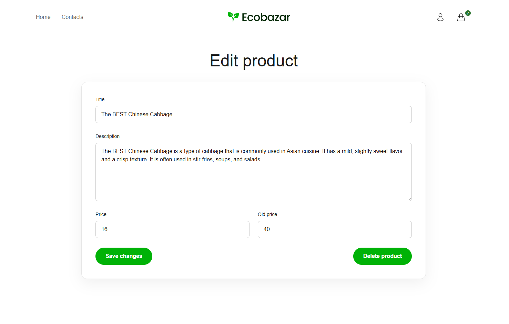

# Ecobazar

Ecobazar is a responsive e-commerce web application built with Angular and Firebase.

The project includes product browsing, product details, shopping cart and order functionality, user authentication, registration, role-based access, and protected product management features.

## Features

- Product catalog with responsive product cards
- Product details page with image gallery
- Shopping cart and order flow
- Add and edit product functionality
- Responsive design for desktop, tablet, and mobile
- Form validation
- User authentication with:
  - Email and password
  - Google
- User registration
- Sign out functionality
- Authentication modal
- Account menu
- Role-based authorization
- Protected routes
- Firebase Authentication integration
- Cloud Firestore integration
- Firestore Security Rules

## User Roles

The application supports three user roles:

- `customer`
- `admin`
- `owner`

New users registered through the application are assigned the `customer` role.

Admin and owner accounts are created through a trusted Firebase setup.

Product management actions are available only to authorized roles.

## Authentication

Authentication is implemented using Firebase Authentication.

Supported methods:

- Email/password sign in
- Email/password registration
- Google sign in

Firebase authentication state is used as the source of truth for determining whether a user is authenticated.

Authentication and authorization are kept separate:

- `AuthService` handles authentication
- `AccessService` handles user roles and permissions
- `UserService` manages Firestore user profiles

## Authorization

User roles are stored in Cloud Firestore:

```text
users/{uid}
  role: "customer" | "admin" | "owner"
```

## Admin functionality

The application includes role-based functionality for `admin` and `owner`
users, including product creation, editing, and deletion.

These routes are protected by Angular route guards and Firestore Security Rules.

Admin credentials are not publicly shared for security reasons.

### Admin view

![Add Product] ()

